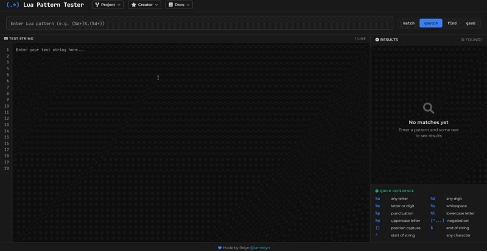

# (.*) Lua Pattern Tester

A live web tool for testing, understanding, and debugging Lua patterns in your browser.

🔗 **Try it here:** [lua-pattern-tester](https://iamreiyn.github.io/lua-pattern-tester)

## Why this exists
Lua patterns are useful, but debugging them can be annoying. This tool helps you test patterns, inspect captures, and understand what each part of a pattern is doing.

## Features
- **Pattern Testing**: Run your Lua patterns and test strings through `match`, `gmatch`, `find`, and `gsub`.
- **Pattern Breakdown**: A custom parser that explains what your pattern is actually doing (captures, classes, etc).
- **Real-time Highlighting**: See matches immediately as you type.
- **Group Extraction**: View exact string and position captures in color-coded cards.
- **Responsive Design**: A responsive and simple user interface that's easy on the eyes.
- **Quick Reference**: A small cheat sheet built right into the UI.
- **Privacy**: Everything runs in your browser. No text or patterns are sent anywhere.

## Usage
1. Enter a Lua pattern.
2. Enter a test string.
3. Choose the Lua function and inspect the output, captures, and explanation.

## Tech Stack
Built with React, Vite, and [`fengari-web`](https://github.com/fengari-lua/fengari-web) (Lua VM). Styling is all custom Vanilla CSS.

## Contributing
I'm always open to feedback or improvements!

1. Fork it
2. Create a branch (`git checkout -b feature/cool-idea`)
3. Commit and Push
4. Open a PR

## License
MIT